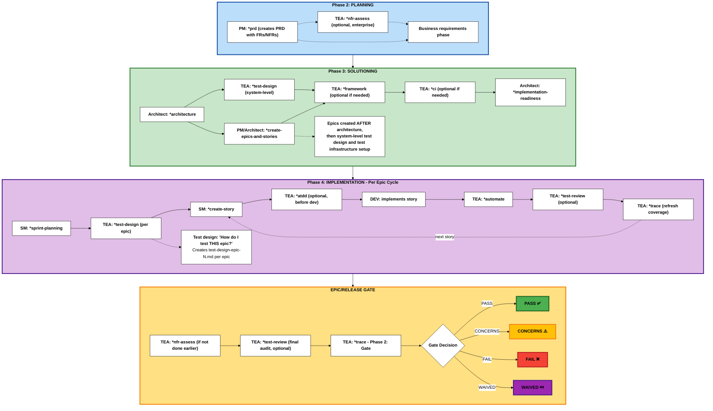

The Test Architect (TEA) is a specialized agent focused on quality strategy, test automation, and release gates in BMad Method projects.

## Overview

- **Persona:** Murat, Master Test Architect and Quality Advisor focused on risk-based testing, fixture architecture, ATDD, and CI/CD governance.
- **Mission:** Deliver actionable quality strategies, automation coverage, and gate decisions that scale with project complexity and compliance demands.
- **Use When:** BMad Method or Enterprise track projects, integration risk is non-trivial, brownfield regression risk exists, or compliance/NFR evidence is required. (Quick Flow projects typically don't require TEA)

---

## Choose Your TEA Engagement Model

BMad does not mandate TEA. There are five valid ways to use it (or skip it). Pick one intentionally.

1. **No TEA**
   - Skip all TEA workflows. Use your existing team testing approach.

2. **TEA-only (Standalone)**
   - Use TEA on a non-BMad project. Bring your own requirements, acceptance criteria, and environments.
   - Typical sequence: `*test-design` (system or epic) -> `*atdd` and/or `*automate` -> optional `*test-review` -> `*trace` for coverage and gate decisions.
   - Run `*framework` or `*ci` only if you want TEA to scaffold the harness or pipeline.

3. **Integrated: Greenfield - BMad Method (Simple/Standard Work)**
   - Phase 3: system-level `*test-design`, then `*framework` and `*ci`.
   - Phase 4: per-epic `*test-design`, optional `*atdd`, then `*automate` and optional `*test-review`.
   - Gate (Phase 2): `*trace`.

4. **Integrated: Brownfield - BMad Method or Enterprise (Simple or Complex)**
   - Phase 2: baseline `*trace`.
   - Phase 3: system-level `*test-design`, then `*framework` and `*ci`.
   - Phase 4: per-epic `*test-design` focused on regression and integration risks.
   - Gate (Phase 2): `*trace`; `*nfr-assess` (if not done earlier).
   - For brownfield BMad Method, follow the same flow with `*nfr-assess` optional.

5. **Integrated: Greenfield - Enterprise Method (Enterprise/Compliance Work)**
   - Phase 2: `*nfr-assess`.
   - Phase 3: system-level `*test-design`, then `*framework` and `*ci`.
   - Phase 4: per-epic `*test-design`, plus `*atdd`/`*automate`/`*test-review`.
   - Gate (Phase 2): `*trace`; archive artifacts as needed.

If you are unsure, default to the integrated path for your track and adjust later.

---

## TEA Workflow Lifecycle

TEA integrates into the BMad development lifecycle during Solutioning (Phase 3) and Implementation (Phase 4):



**Phase Numbering Note:** BMad uses a 4-phase methodology with optional Phase 1 and documentation prerequisite:

- **Documentation** (Optional for brownfield): Prerequisite using `*document-project`
- **Phase 1** (Optional): Discovery/Analysis (`*brainstorm`, `*research`, `*product-brief`)
- **Phase 2** (Required): Planning (`*prd` creates PRD with FRs/NFRs)
- **Phase 3** (Track-dependent): Solutioning (`*architecture` → `*test-design` (system-level) → `*create-epics-and-stories` → TEA: `*framework`, `*ci` → `*implementation-readiness`)
- **Phase 4** (Required): Implementation (`*sprint-planning` → per-epic: `*test-design` → per-story: dev workflows)

**TEA workflows:** `*framework` and `*ci` run once in Phase 3 after architecture. `*test-design` is **dual-mode**:

- **System-level (Phase 3):** Run immediately after architecture/ADR drafting to produce `test-design-system.md` (testability review, ADR → test mapping, Architecturally Significant Requirements (ASRs), environment needs). Feeds the implementation-readiness gate.
- **Epic-level (Phase 4):** Run per-epic to produce `test-design-epic-N.md` (risk, priorities, coverage plan).

Quick Flow track skips Phases 1 and 3.
BMad Method and Enterprise use all phases based on project needs.
When an ADR or architecture draft is produced, run `*test-design` in **system-level** mode before the implementation-readiness gate. This ensures the ADR has an attached testability review and ADR → test mapping. Keep the test-design updated if ADRs change.

---

## Why TEA is Different from Other BMM Agents

TEA is the only BMM agent that operates in **multiple phases** (Phase 3 and Phase 4) and has its own **knowledge base architecture**.

### Phase-Specific Agents (Standard Pattern)

Most BMM agents work in a single phase:

- **Phase 1 (Analysis)**: Analyst agent
- **Phase 2 (Planning)**: PM agent
- **Phase 3 (Solutioning)**: Architect agent
- **Phase 4 (Implementation)**: SM, DEV agents

### TEA: Multi-Phase Quality Agent (Unique Pattern)

TEA is **the only agent that operates in multiple phases**:

```
Phase 1 (Analysis) → [TEA not typically used]
    ↓
Phase 2 (Planning) → [PM defines requirements - TEA not active]
    ↓
Phase 3 (Solutioning) → TEA: *framework, *ci (test infrastructure AFTER architecture)
    ↓
Phase 4 (Implementation) → TEA: *test-design (per epic: "how do I test THIS feature?")
                        → TEA: *atdd, *automate, *test-review, *trace (per story)
    ↓
Epic/Release Gate → TEA: *nfr-assess, *trace Phase 2 (release decision)
```

### TEA's 8 Workflows Across Phases

**Standard agents**: 1-3 workflows per phase
**TEA**: 8 workflows across Phase 3, Phase 4, and Release Gate

| Phase       | TEA Workflows                                             | Frequency        | Purpose                                        |
| ----------- | --------------------------------------------------------- | ---------------- | ---------------------------------------------- |
| **Phase 2** | (none)                                                    | -                | Planning phase - PM defines requirements       |
| **Phase 3** | \*framework, \*ci                                         | Once per project | Setup test infrastructure AFTER architecture   |
| **Phase 4** | \*test-design, \*atdd, \*automate, \*test-review, \*trace | Per epic/story   | Test planning per epic, then per-story testing |
| **Release** | \*nfr-assess, \*trace (Phase 2: gate)                     | Per epic/release | Go/no-go decision                              |

**Note**: `*trace` is a two-phase workflow: Phase 1 (traceability) + Phase 2 (gate decision). This reduces cognitive load while maintaining natural workflow.

---

## TEA Command Catalog

| Command        | Primary Outputs                                                                               | Notes                                                |
| -------------- | --------------------------------------------------------------------------------------------- | ---------------------------------------------------- |
| `*framework`   | Playwright/Cypress scaffold, `.env.example`, `.nvmrc`, sample specs                           | Use when no production-ready harness exists          |
| `*ci`          | CI workflow, selective test scripts, secrets checklist                                        | Platform-aware (GitHub Actions default)              |
| `*test-design` | Combined risk assessment, mitigation plan, and coverage strategy                              | Risk scoring + optional exploratory mode             |
| `*atdd`        | Failing acceptance tests + implementation checklist                                           | TDD red phase + optional recording mode              |
| `*automate`    | Prioritized specs, fixtures, README/script updates, DoD summary                               | Optional healing/recording, avoid duplicate coverage |
| `*test-review` | Test quality review report with 0-100 score, violations, fixes                                | Reviews tests against knowledge base patterns        |
| `*nfr-assess`  | NFR assessment report with actions                                                            | Focus on security/performance/reliability            |
| `*trace`       | Phase 1: Coverage matrix, recommendations. Phase 2: Gate decision (PASS/CONCERNS/FAIL/WAIVED) | Two-phase workflow: traceability + gate decision     |

---

## Related Documentation

- [Setup Test Framework](../../how-to/workflows/setup-test-framework.md) - How to set up testing infrastructure
- [Run Test Design](../../how-to/workflows/run-test-design.md) - Creating test plans
